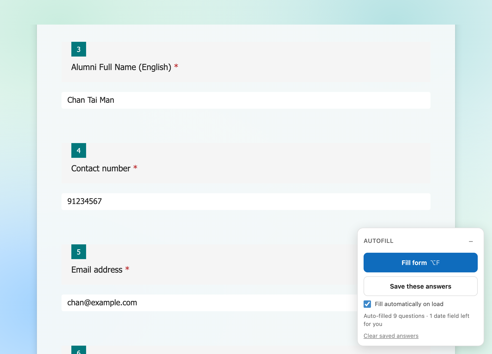

# MS Forms Autofill

A Chrome extension that remembers your answers on a Microsoft Form and puts them back next time. One click, or none.

It never fills date fields. That's the one thing that changes every submission, so it stays yours to type.



## Why

Some Microsoft Forms you submit again and again — a parking request, a visitor pass, a weekly report. Same name, same phone, same plate number, retyped every time.

Browser autofill doesn't help. Microsoft Forms renders every input through React with generated ids and no `name` or `autocomplete` attributes, so Chrome has nothing to match on and leaves the fields empty.

So this fills them from answers you saved yourself.

## Install

1. Download this repo (green **Code** button → **Download ZIP**, then unzip). Or `git clone https://github.com/kentaccn/msforms-autofill.git`
2. Open `chrome://extensions`
3. Turn on **Developer mode**, top right
4. Click **Load unpacked** and pick the folder with `manifest.json` in it
5. Open your form — a small **AUTOFILL** panel appears bottom right

Chrome keeps it after restarts. It runs only on `forms.cloud.microsoft`, `forms.office.com`, `forms.microsoft.com` and `forms.office365.com`.

### First run

1. Fill the form in by hand once, everything except the date
2. Click **Save these answers**
3. Tick **Fill automatically on load** if you want it to happen with no clicks

Next time you open the form it's already filled. Type the date, check it, submit.

- **Fill form** or `⌥F` — refill on demand
- **Save these answers** — replace what's stored with what's on screen now
- **Clear saved answers** — wipe it for this form
- **−** — collapse the panel

### Without installing anything

Open the form, press `⌥⌘J` (`Ctrl+Shift+J` on Windows/Linux) for the Console, paste all of `console-snippet.js`, press Enter. Same panel.

You re-paste it on every page load, clearing browser data wipes it, and answers are stored per hostname — something saved on `forms.office.com` won't be there on `forms.cloud.microsoft`. The extension has none of those problems.

## What it handles

| Question type | Behaviour |
|---|---|
| Short and long text | Saved and refilled |
| Single choice | Saved and refilled |
| Multiple choice | Saved and refilled, including the "Other" free text |
| Likert grids | Saved and refilled per row |
| Date | Never touched |
| Ranking, dropdown, file upload, star rating | Not supported — the panel tells you how many it skipped |

Multi-page forms work. Saving on page 2 merges with page 1 instead of replacing it, and with auto-fill on it refills each page as you press Next.

Each form gets its own storage slot keyed off its URL, so several forms don't collide.

## How this compares

There are a handful of Microsoft Forms fillers on GitHub. They solve different problems, and it's worth knowing which one you actually want.

| | This | [saturina0611/Autofill-Microsoft-Forms](https://github.com/saturina0611/Autofill-Microsoft-Forms) | [chonghaoooi/auto-fill-forms](https://github.com/chonghaoooi/auto-fill-forms) | Generic fillers (Fake Filler, etc.) |
|---|---|---|---|---|
| Where answers come from | Recorded from your own submission | An answer key you hand-edit into the JS | A fixed profile (name, ID, phone, class, email) | Random junk, or a fixed profile |
| Built for | Re-submitting the same form | Quizzes with shuffled questions | Student forms with standard fields | Testing your own forms |
| Matches questions by | Internal `QuestionId` | Question title text, fuzzy | Field label keywords | Field `name` / `autocomplete` |
| Works on `forms.cloud.microsoft` | Yes | Yes (console) | No — `forms.office.com` only | Mostly not |
| Skips date fields | Yes, deliberately | No | No | No |
| Multi-page forms | Merges and refills per page | No | No | No |
| Licence | MIT | None stated | None stated | Varies |

Star counts on all of these are single digits — nobody has really claimed this space.

**Use this one** if you re-submit the same form regularly and want it to remember what you typed without configuring anything.

**Use saturina0611's** if you're filling a quiz from a known answer key and the questions get shuffled. That's a genuinely different job and it does it in one console script.

**Use a generic filler** if you're a developer stuffing your own forms with test data.

Two differences worth calling out, because they cost real debugging time:

- **Matching on `QuestionId`, not question text.** Titles get edited and reordered, and fuzzy substring matching across similar titles picks the wrong question. The internal id doesn't move.
- **`forms.cloud.microsoft`.** Microsoft has been moving Forms onto this host. Extensions that only list `forms.office.com` silently never load.

Note that "no licence stated" means all rights reserved by default — you can read those repos but you can't legally reuse the code. This one is MIT.

## Fork and modify

```bash
git clone https://github.com/kentaccn/msforms-autofill.git
cd msforms-autofill
npm install     # puppeteer-core, only needed for the tests
npm test
```

The files:

| File | What it is |
|---|---|
| `content.js` | Everything. Reading the form, writing to it, storage, the panel. |
| `manifest.json` | MV3 manifest. Add hosts here. |
| `build-console.js` | Wraps `content.js` in a localStorage shim to make the console build |
| `console-snippet.js` | Generated — don't hand-edit it |
| `test/run.js` | Drives the real code against a local mock form |
| `test/mock-form.html` | Mock Forms markup, including types the author's own form doesn't have |

**`content.js` is the only source file.** After editing it, run `npm run build` to regenerate `console-snippet.js`, then `npm test`.

### Common changes

**Add another host.** Put it in both `host_permissions` and `content_scripts[0].matches` in `manifest.json`, then reload the extension.

**Fill the date too** (if your form's date is always the same). In `fillAnswers()`, drop the `if (type === 'date')` early return, and in `readAnswers()` drop the matching `continue`. The date box is a Fluent `DatePicker` combobox — setting its value needs the same native-setter treatment the text inputs get, plus a `blur` for it to commit.

**Support a new question type.** Three places, all in `content.js`:

1. `questionType()` — recognise it and return a new type name
2. `readAnswers()` — pull the current answer into a record
3. `fillAnswers()` — put a saved record back

Dropdowns need the combobox opened before the `[role="option"]` elements exist. Ranking needs the move buttons driven in order. Both are why they're unsupported here.

**Change the shortcut.** The `keydown` listener near the bottom of `content.js`.

### Testing

`npm test` serves `test/mock-form.html` locally and drives the real content script against it with headless Chrome. It covers long text, Likert grids where both rows share the same option values, checkbox with "Other", date-skipping, and multi-page save-merge plus auto-refill after Next.

It doesn't touch any real Microsoft Form. Set `CHROME_PATH` if Chrome isn't in the usual macOS location:

```bash
CHROME_PATH=/usr/bin/google-chrome npm test
```

One warning from experience: **Microsoft Forms restores a draft of your answers on reload.** An early version of this test "passed" because the form was never actually empty and the fill had nothing to do. If you write a test like this, clear the draft first and assert the form is blank before you trust a pass.

## How Microsoft Forms actually works

Three things that cost time to find, in case you're writing anything against Forms.

**Trusted Types silently break `innerHTML`.** The response page sends `require-trusted-types-for 'script'` with a default policy. Assigning an HTML string to `innerHTML` doesn't throw — it just produces an empty element. The panel here is built with `createElement` and `textContent` for that reason. If your injected UI renders as nothing, this is why.

**The "Other" checkbox and its text box share `aria-label="Other answer"`.** A selector on that label grabs the checkbox and your free text never saves. The text box is the one without a `role` attribute. It's also only mounted *after* the checkbox is ticked, so writing to it has to wait for it to appear.

**React ignores `element.value = x`.** You need the native prototype setter, then dispatch bubbling `input` and `change` events:

```js
const setter = Object.getOwnPropertyDescriptor(HTMLInputElement.prototype, 'value').set;
setter.call(el, value);
el.dispatchEvent(new Event('input', { bubbles: true }));
```

Useful anchors, all stable: `[data-automation-id="questionItem"]`, `questionTitle`, `textInput`, `dateContainer`, and the `QuestionId_r…` element that carries each question's internal id.

## Privacy

Answers stay on your machine — `chrome.storage.local` for the extension, `localStorage` for the console version. Nothing is sent anywhere. There's no analytics and no network code.

They're stored unencrypted on disk, the same as any browser autofill. Depending on the form that could include your phone, email, ID or plate number. `Clear saved answers` wipes a form's entry.

## Limits

- Ranking, dropdown, file upload and star-rating questions aren't supported. The panel reports how many it skipped rather than pretending.
- It fills the form. It never submits it — you always press submit yourself.
- Tested against a live form and a local mock on Chrome. Not tested on Edge or Firefox, though nothing in it is Chrome-specific beyond the MV3 manifest.

## Licence

MIT — see [LICENSE](LICENSE).
